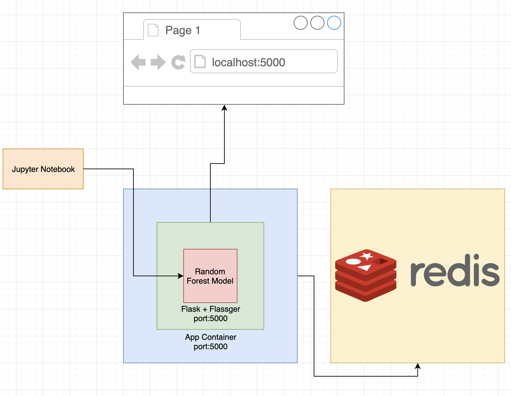
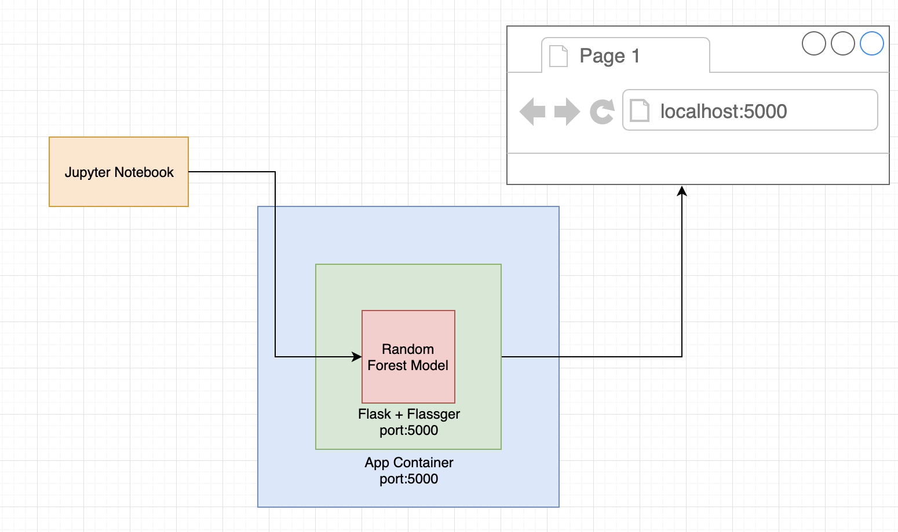
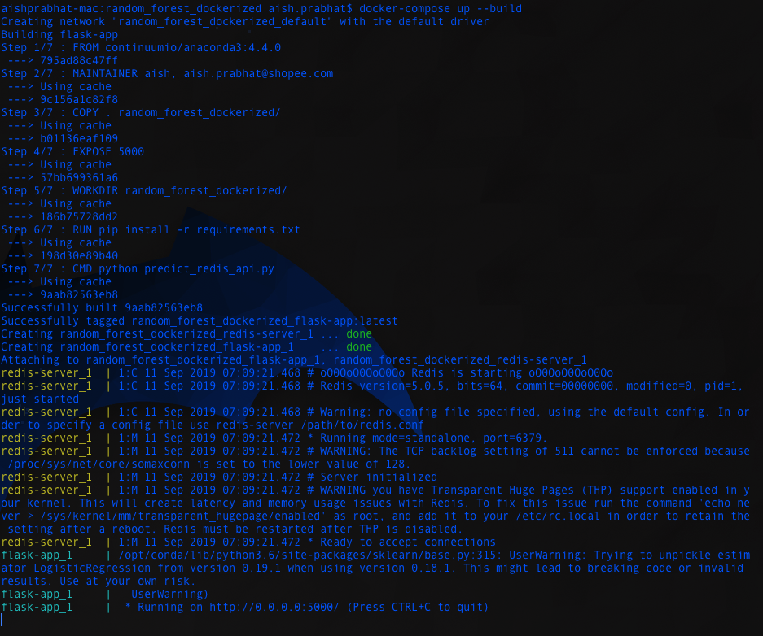
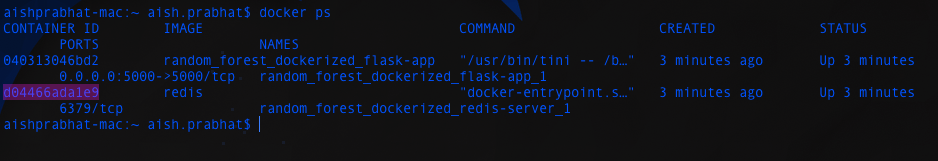

# Machine Learning Dockerized


## Overview
This git repo serves as a tutorial, guide to best practices [BP] and cheatsheet for Dockerizing your Machine Learning microservice. The tutorial plan is as follows:



- We will use the [IRIS dataset](https://archive.ics.uci.edu/ml/datasets/iris) to train a Random Forest model
- Train a model in a Jupyter notebook using scikilt-learn
- Export the model using pickle
- Expose the model using Flask and Flassger
- Containerize the Flask App using Docker
- Rebuild the App container to write some data to another container hosting Redis (using Docker Compose)

### Aboud the technologies

- Docker: an ecosystem/platform around creating and running containers
- Redis: (Remote Dictionary Server) an in-memory data structure store, used as a database, cache and message broker.
- Flask: a micro web framework written in Python.
- Flassger: a Flask extension to validate, visualize and interact with your Flask API
- Jupyter Notebook: a tool for interactively developing and presenting (Python) data science projects

### Why Docker?

- It makes it very simple to install and run software without having to worry about dependencies and setup
- Essential for a Microservices-based Architecture

## Dockerizing a Random Forest Model


You can find instructions for dowloading Docker [here](https://docs.docker.com/docker-for-mac/install/).

### Description
A Random Forest model built to classify a flower using the [IRIS dataset](https://archive.ics.uci.edu/ml/datasets/iris). The model is exposed using Flask and then containerized using Docker.  

### Training, testing and exporting the model
Refer to `random_forest_dockerized/Train and Export Model.ipynb`

- First we will load the dataset
- Split into training, validation 
- Train the model
- Test model performance on certain metrics
- Store the model in a pickle file


### Exposing model through Flask and Flasgger

Refer to `random_forest_dockerized/predict_api.py`

```
import pickle
from flask import Flask, request, jsonify
from flasgger import Swagger
import numpy as np
import pandas as pd

with open('iris_model.pkl', 'rb') as model_file:
    model = pickle.load(model_file)

app = Flask(__name__)
swagger = Swagger(app)

@app.route('/predict')
def predict_iris():
    """Example endpoint returning a prediction of iris
    ---
    parameters:
      - name: s_length
        in: query
        type: number
        required: true
      - name: s_width
        in: query
        type: number
        required: true
      - name: p_length
        in: query
        type: number
        required: true
      - name: p_width
        in: query
        type: number
        required: true
    responses:
      200:
        description: Index of predicted class 

    """
    s_length = float(request.args.get("s_length"))
    s_width = float(request.args.get("s_width"))
    p_length = float(request.args.get("p_length"))
    p_width = float(request.args.get("p_width"))
    
    print("Predicting!")
    prediction = model.predict(np.array([[s_length, s_width, p_length, p_width]]))
    # print(prediction)

    print("Returning Prediction")
    return str(prediction)

@app.route('/predict_file', methods=["POST"])
def predict_iris_file():
    """Example file endpoint returning a prediction of iris
    ---
    parameters:
      - name: input_file
        in: formData
        type: file
        required: true
    """
    input_data = pd.read_csv(request.files.get("input_file"), header=None)
    prediction = model.predict(input_data)
    return str(list(prediction))

if __name__ == '__main__':
    app.run(host='0.0.0.0', port=5000)
```
    
### Testing the app

- Ensure that you have the necessary packages installed (flask, fassger, sklearn)
- Ensure that you are in the `random_forest_dockerized/` directory and run `python predict_api.py`
 
- Open your browser and go to `http://localhost:5000/apidocs`. You should see something like this:
 
- Click on `Try it out` and enter values into the fields and press `Execute`
- You should see something like this. You can see the prediction in the `Response body` section:
 


### Writing a Dockerfile to create an Image

#### What happens to a docker file?


- Dockerfile is a file which we create. It holds onto all the compexity and is the tamplate based on which a docker image is created.
- Through Docker Client (CLI) we pass the dockerfile to the Docker Server
	- Docker Client: A command-line interface to which we issue commands
- Docker Server creates the usable docker image based on the docker file
	- Docker Server: A Docker Daemon/Tool responsible for creating and running images behind the scenes

#### What is an image?

A single file with all the dependencies and config to install and run a program.

#### How do we create a docker file?

- Specify a base image. A based image is an image that is most useful for building the image that we want to build.
- Run some commands to install additional programs
- Specify a command to run on container startup

Refer to `random_forest_dockerized/Dockerfile`

```
FROM continuumio/anaconda3:4.4.0
MAINTAINER aish, aish.prabhat@shopee.com
COPY . random_forest_dockerized/
EXPOSE 5000
WORKDIR random_forest_dockerized/
RUN pip install -r requirements.txt
CMD python predict_api.py
```

- `FROM continuumio/anaconda3:4.4.0`: use the continuumio image as a base image. A base image is typically an image of a 'light weight' pre-built container. It is something on top of which our container is built.
- `COPY . random_forest_dockerized/`: copy the necessary files into the container. In this case all the files are copied to a new directory called `random_forest_dockerized`
- `EXPOSE 5000`: expose port 5000 to the 'outside world'
- `WORKDIR random_forest_dockerized/`: use `random_forest_dockerized/` as the working directory. If it doesn't exist create it. [BP] It is always good to create a working directory or multiple working directories to give some structure to your project within the container. This is especially good to follow so that your files don't overwrite files from the base image.
- `RUN pip install -r requirements.txt`: run some command - in this case install requirements
- `CMD python predict_api.py`: the final command to run after all the set up is done


### Build a Docker Image
Ensure you are in the `random_forest_dockerized/` directory and run `docker build -t rf-api .`
It should look something like this:


We can use `docker images` to see the image we have built. 

#### Command explanation:
- `build`: for building an image from a docker file
- `-t rf-api`: tag the image with the name `rf-api`
- `.`: build context - use the current working directory. Docker will look for a file called 'Dockerfile'

#### [BP] Best practices for reducing build time

##### 1. Cache Bursting
A neat trick to avoid cache bursting and rebuilding the image is to copy the files that are unlikely to change - especially those necessary for installing dependencies. Then place the COPY command, which will replace the file that has been changed, strategically after all the dependency installation commands. For example, lets say we have the following dockerfile:

```
FROM continuumio/anaconda3:4.4.0
MAINTAINER aish, aish.prabhat@shopee.com
COPY . random_forest_dockerized/
EXPOSE 5000
WORKDIR random_forest_dockerized/
RUN pip install -r requirements.txt
CMD python predict_api.py
```

We can instead write it like this:
```
FROM continuumio/anaconda3:4.4.0
MAINTAINER aish, aish.prabhat@shopee.com
COPY ./requirements.txt random_forest_dockerized/
RUN pip install -r requirements.txt
EXPOSE 5000
WORKDIR random_forest_dockerized/
COPY . random_forest_dockerized/
CMD python predict_api.py
```
In this case the uncached instructions are only the last two commands.

##### Using &&\ to run multiple commands
Instead of this:

```
FROM busybox
RUN echo This is the A > a
RUN echo This is the B > b
RUN echo This is the C > c
```

Use this:

```
FROM busybox
RUN echo This is the A > a &&\
    echo This is the B > b &&\
    echo This is the C > c
```

This is because putting several `RUN` commands will cause the layering behaviour of Docker to build one container after another just to run these commands

##### Other tips:
- Copy minimal number and size of files
- Use a `.dockerignore` file to leave out files you don't want copied onto the container

### Running a Container

- Run `docker run -p 4000:5000 rf-api`
- Now open your browser and go to `http://localhost:4000/apidocs`. You should be able to see something like: 

- Click on `Try it out` and enter values into the fields and press `Execute`
- You should see something like this. You can see the prediction in the `Response body` section:
 

#### Command explanation:
- `run`: run a container from the built image
- `-p 4000:5000`: forward port 5000 of the container to 4000 of the host


### Taking a look inside our running container

You can view running containers using `docker ps`.

You can run commands inside a running container by using the command `docker exec -it <container-id> <command>` 
For example we can run `docker exec -it <container-id> sh` to open a shell inside our running container.


### Stopping containers

There are two ways to stop a running container

1. `docker stop <container-id>`
	- Sends a sigterm (terminate signal) command to the process which allows a bit of time to clean up before stopping
	- Many programs/processes/softwares can be programmed to perform own clean up process for graceful shutdown
	- However if the container does not stop within 10s, docker will issue docker kill
2. `docker kill <container-id>` issues sigkill command to the process which shuts down the process immediately


## Multi-Container App using Docker Compose

We will get our Flask app container to interact with a Redis container to record predictions using docker compose.


### What is docker-compose?

- Docker compose is a separate CLI that gets installed with Docker
- It is used to start up multiple Docker containers at the same time
- Automates some of the long-winded arguments we were passing to docker run
- When we used docker compose, the containers built together share a network i.e. no port forwarding required for communication between containers

### Making changes to our Flask API

Refer to `random_forest_dockerized/predict_redis_api.py`

```
import pickle
from flask import Flask, request, jsonify
from flasgger import Swagger
import numpy as np
import pandas as pd
import redis

with open('iris_model.pkl', 'rb') as model_file:
    model = pickle.load(model_file)

app = Flask(__name__)
swagger = Swagger(app)


redis_host = "redis-server"
redis_port = 6379
redis_password = ""

prediction_index = 0

@app.route('/predict')
def predict_iris():
    """Example endpoint returning a prediction of iris
    ---
    parameters:
      - name: s_length
        in: query
        type: number
        required: true
      - name: s_width
        in: query
        type: number
        required: true
      - name: p_length
        in: query
        type: number
        required: true
      - name: p_width
        in: query
        type: number
        required: true
    responses:
      200:
        description: Index of predicted class 

    """
    global prediction_index
    s_length = float(request.args.get("s_length"))
    s_width = float(request.args.get("s_width"))
    p_length = float(request.args.get("p_length"))
    p_width = float(request.args.get("p_width"))
    
    print("Predicting!")
    prediction = model.predict(np.array([[s_length, s_width, p_length, p_width]]))
    # print(prediction)

    prediction_index+=1
    r = redis.StrictRedis(host=redis_host, port=redis_port, password=redis_password, decode_responses=True)
    r.set(str(prediction_index),str(prediction))

    print("Returning Prediction")
    return str(prediction)

@app.route('/predict_file', methods=["POST"])
def predict_iris_file():
    """Example file endpoint returning a prediction of iris
    ---
    parameters:
      - name: input_file
        in: formData
        type: file
        required: true
    """
    input_data = pd.read_csv(request.files.get("input_file"), header=None)
    prediction = model.predict(input_data)
    return str(list(prediction))

if __name__ == '__main__':
    app.run(host='0.0.0.0', port=5000)
```

### New Dockerfile

Small change in previous docker file - refer to `random_forest_dockerized/Dockerfile_with_redis`

```
FROM continuumio/anaconda3:4.4.0
MAINTAINER aish, aish.prabhat@shopee.com
COPY . random_forest_dockerized/
EXPOSE 5000
WORKDIR random_forest_dockerized/
RUN pip install -r requirements.txt
CMD python predict_redis_api.py
```

### Writing Docker Compose file

Refer to `random_forest_dockerized/Dockerfile_with_redis` 

```
version: '3'
services:
  redis-server:
    image: 'redis'
  flask-app:
    build:
      context: .
      dockerfile: Dockerfile_with_redis
    ports:
      - "5000:5000"
    restart: always
```

#### docker-compose.yml explained
- `version: '3'` specifies the version of docker compose we want to use
- `services:` essentially refers to containers we want to build
- `redis-server:` image: 'redis' tells docker to build a new container (service) using the image redis. 'redis-server' is also used as a 'domain name' within the docker network for other containers to call this redis container. 
-  `flask-app`:tells docker to build a new container (service)
	-  `build`: specify build parameters
		-  `context: .`: use current working directory as build context
		-  `dockerfile: Dockerfile_with_redis`: use the specified file to build image
	-  `ports: - "5000:5000"` tells docker to map port 5000 of local machine to port 5000 of container
	-  `restart`: the restarting policy for the container
	

### Running Containers

While in the `random_forest_dockerized/` directory, run `docker-compose up --build`

You should see something like this:



### Testing the App 

1. Functioning of the App
- Now open your browser and go to `http://localhost:5000/apidocs`. You should be able to see something like: 

- Click on `Try it out` and enter values into the fields and press `Execute`
- You should see something like this. You can see the prediction in the `Response body` section:
 
 
2. Checking communication with Redis

- Use `docker ps` to find out the container-id of the redis container

- Run `docker exec -it d04466ada1e9 redis-cli` 
	- Run `get 0` and you will see the first prediction made by the app

#### docker-compose down


    
    
    
    
